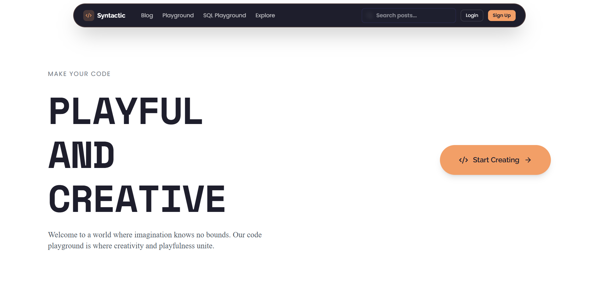

<div align="center">

# Syntactic

A developer blog platform with live code playgrounds. Write posts in MDX, embed executable code, and sync your work across devices.

**[syntactic.vercel.app](https://syntactic.vercel.app/)**

</div>




## What it does

Write technical blog posts with embedded code playgrounds that actually run. Code executes in isolated workers (JavaScript/TypeScript) or via Piston API (Python, Java, C, C++). Everything syncs across devices using a private key system instead of traditional auth.

**Blog features:**
- MDX support with live preview
- Full-text search
- Post series and tags
- Reading time & progress tracking

**Playground:**
- Multi-language support
- Auto-save every 2 seconds
- Works for anonymous users (sessions expire after 1 hour)
- File management with folders

**Security stuff:**
- Code runs in worker threads, no eval()
- Rate limiting (10/min for logged in users, 5/min anonymous)
- Cloudflare Turnstile after 3 anonymous runs
- DOMPurify for MDX sanitization

## Setup

You'll need Node.js 18+, a Supabase account, and Cloudflare Turnstile keys.

```bash
git clone https://github.com/0anshuaditya0/syntactic.git
cd syntactic
npm install
cp .env.example .env.local
```

Add your Supabase and Turnstile credentials to `.env.local`, then run the database schema in your Supabase project.

```bash
npm run dev
```

Visit `localhost:3000`

## Stack

- Next.js 14 (app router)
- TypeScript
- Tailwind + shadcn/ui
- Supabase (PostgreSQL + Auth + Storage)
- Monaco Editor
- Worker threads for JS/TS execution
- Piston API for other languages

## Project structure

```
app/
  ├── api/              # Route handlers
  ├── blog/             # Post pages
  ├── playground/       # Code editor
  └── write/            # Post editor
components/
  ├── ui/               # shadcn components
  ├── blog/
  └── code/
lib/
  ├── supabase.ts
  └── code/             # Execution logic
workers/                # Code execution workers
```

## Deploy

Works on Vercel out of the box. Push to GitHub, import to Vercel, add environment variables, done.

## License

MIT

---

Made by [@AnshuAd43072185](https://x.com/AnshuAd43072185)